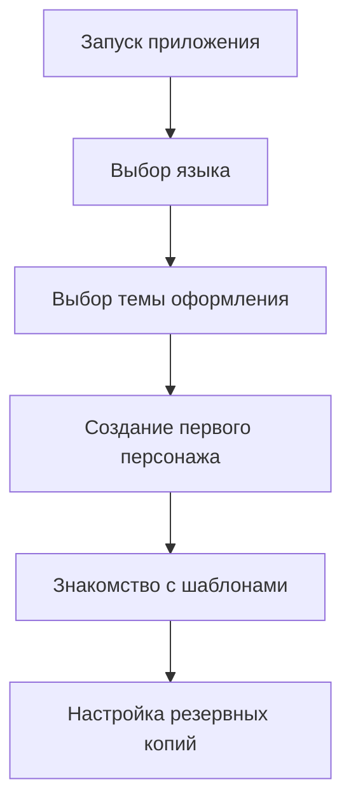

# 🚀 Установка и настройка CharacterBook

## 📥 Способы установки

### 🎯 Для конечных пользователей

#### **📱 Мобильные устройства**
| Платформа | Магазин | Статус | Ссылка |
|-----------|---------|--------|---------|
| **Android** | Google Play | ✅ Доступно | [Скачать из Google Play](https://play.google.com/store/apps/details?id=ru.maxgog.listcharacters&hl) |
| **Android** | RuStore | ✅ Доступно | [Скачать из RuStore](https://www.rustore.ru/catalog/app/ru.maxgog.listcharacters) |
| **iOS** | App Store | 🔄 В разработке | *Скоро будет доступно* |

#### **💻 Десктопные платформы**
| Платформа | Магазин | Статус | Ссылка |
|-----------|---------|--------|---------|
| **Windows** | Microsoft Store | ✅ Доступно | [Скачать из Microsoft Store](https://apps.microsoft.com/detail/9NKV4DBQJW0S) |
| **Windows/macOS** | GitHub Releases | ✅ Доступно | [Скачать последнюю версию](https://github.com/maxgog/characterbook/releases) |
| **Linux** | Snap Store | 🔄 В разработке | *Скоро будет доступно* |

#### **🌐 Веб-версия**
| Платформа | Статус | Доступ |
|-----------|--------|---------|
| **Web** | 🔄 В разработке | *Скоро будет доступна онлайн-версия* |

---

## 🛠 Для разработчиков и энтузиастов

### 📋 Предварительные требования

#### **Обязательное ПО:**
| Компонент | Минимальная версия | Рекомендуемая версия | Проверка |
|-----------|-------------------|----------------------|----------|
| **Flutter SDK** | 3.0.0 | 3.13.0+ | `flutter --version` |
| **Dart SDK** | 2.17.0 | 3.7.2+ | `dart --version` |
| **Git** | 2.25.0 | 2.40.0+ | `git --version` |

#### **Платформо-специфичные требования:**
| Платформа | Требования |
|-----------|------------|
| **Android** | Android SDK, Java JDK 11+, включённый режим разработчика |
| **Windows** | Visual Studio 2019+ с C++ инструментами |
| **Linux** | Clang, GTK3, Ninja |
| **macOS** | Xcode 12+ (для iOS/macOS сборки) |
| **Web** | Chrome 90+ для тестирования |

### ⚙️ Пошаговая установка

```bash
# 1. Клонируйте репозиторий
git clone https://github.com/maxgog/characterbook.git
cd characterbook

# 2. Установите зависимости Flutter
flutter pub get

# 3. Проверьте окружение разработки
flutter doctor

# 4. Запустите приложение в режиме разработки
flutter run
```

#### **Сборка для различных платформ:**

```bash
# 📱 Android APK
flutter build apk --release

# 🤖 Android App Bundle
flutter build appbundle --release

# 🪟 Windows
flutter build windows --release

# 🌐 Web
flutter build web --release

# 🐧 Linux
flutter build linux --release

# 🍎 macOS
flutter build macos --release
```

#### **Создание установочных пакетов:**

```bash
# Windows MSIX (для Microsoft Store)
flutter build windows
flutter pub run msix:create

# Android APK/AAB (для Google Play)
flutter build apk --release
flutter build appbundle --release
```

---

## 🎯 Первоначальная настройка

### 🏁 Первый запуск



### ⚙️ Основные настройки

#### **🎨 Внешний вид:**
| Настройка | Варианты | По умолчанию |
|-----------|----------|--------------|
| **Тема** | Светлая, Тёмная, Системная | Системная |
| **Цветовая схема** | Фиолетовая, Синяя, Зелёная, Оранжевая | Синяя |

#### **💾 Хранение данных:** (скоро будет доступно)
| Настройка | Описание | Рекомендация |
|-----------|----------|--------------|
| **Автосохранение** | Интервал автоматического сохранения | 30 секунд |
| **Резервные копии** | Создание бэкапов при изменении | Включено |
| **Экспорт PDF** | Качество экспортируемых документов | Высокое |

#### **🌍 Язык и регион:** (скоро будет доступно)
| Настройка | Поддерживаемые значения |
|-----------|-------------------------|
| **Язык интерфейса** | Русский, Английский |
| **Формат даты** | DD.MM.YYYY, MM/DD/YYYY, YYYY-MM-DD |
| **Часовой пояс** | Системный, Выбор вручную |

---

## 🔄 Обновление приложения

### **🔄 Автоматическое обновление:**
- **Магазины приложений**: Google Play, Microsoft Store, RuStore
- **Уведомления**: Получайте уведомления о новых версиях через дистрибьюторов

### **📥 Ручное обновление:**

#### **Для пользователей:**
1. Скачайте новую версию из [GitHub Releases](https://github.com/maxgog/characterbook/releases)
2. Установите поверх старой версии
3. Данные сохранятся автоматически

#### **Для разработчиков:**
```bash
# Обновите исходный код
git pull origin main

# Обновите зависимости
flutter pub get

# Очистите предыдущие сборки (при необходимости)
flutter clean

# Пересоберите приложение
flutter build
```

---

## 🐛 Решение проблем

### **🚨 Частые проблемы и решения**

#### **Приложение не запускается:**
| Симптом | Возможная причина | Решение |
|---------|-------------------|---------|
| ❌ "Приложение остановлено" | Несовместимость версии ОС | Проверьте системные требования |
| 📱 Вылетает при запуске | Недостаточно памяти | Освободите 100+ МБ места |
| 🔄 Бесконечная загрузка | Повреждение кэша | Очистите кэш приложения |

#### **Проблемы с установкой для разработчиков:**
```bash
# 🔧 Команды для диагностики и решения проблем:

# 1. Проверка окружения Flutter
flutter doctor -v

# 2. Очистка кэша сборки
flutter clean

# 3. Восстановление зависимостей
flutter pub deps

# 4. Обновление Flutter SDK
flutter upgrade

# 5. Проверка целостности проекта
flutter analyze
```

#### **Проблемы с экспортом данных:**
| Проблема | Решение |
|----------|---------|
| 📄 "Не удалось создать PDF" | Проверьте разрешения на запись |
| 💾 "Недостаточно места" | Освободите место на устройстве |
| 🔒 "Доступ запрещён" | Предоставьте права на доступ к хранилищу |

### **📞 Получение помощи**

Если вы столкнулись с проблемами, которые не описаны выше:

1. **📋 Проверьте [Issues на GitHub](https://github.com/maxgog/characterbook/issues)** - возможно, проблема уже известна
2. **🐛 Создайте новый Issue** с подробным описанием проблемы:
   - Версия приложения
   - Платформа и версия ОС
   - Шаги для воспроизведения
   - Скриншоты или логи ошибок

---

## 🔒 Безопасность и разрешения

### **🛡️ Требуемые разрешения:**
| Разрешение | Назначение | Обязательность |
|------------|------------|----------------|
| **Хранилище** | Сохранение персонажей, резервных копий | ✅ Обязательно |
| **Камера** | Создание фото персонажей | 🔶 Опционально |
| **Интернет** | Обновления, облачная синхронизация | 🔶 Опционально |

### **🔐 Защита данных:**
- Все данные хранятся локально на устройстве
- Резервные копии шифруются
- Отсутствует сбор личной информации
- Политика конфиденциальности доступна в настройках приложения

---

<div align="center">

## 🎉 Готовы начать?

**Выберите удобный способ установки и присоединяйтесь к сообществу CharacterBook!**

[📥 GitHub Releases](https://github.com/maxgog/characterbook/releases) • 
[📚 Документация](ARCHITECTURE.md) • 
[🎮 Возможности](FEATURES.md) • 
[❓ Поддержка](https://github.com/maxgog/characterbook/issues)

*При возникновении вопросов не стесняйтесь обращаться к сообществу!*

</div>