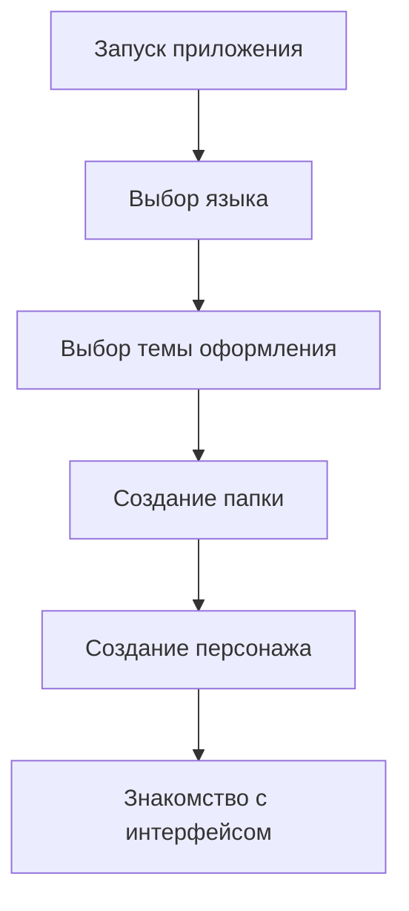

# 📚 CharacterBook - Руководство пользователя

## 🎯 Начало работы

### 🚀 Первый запуск



### 👤 Создание первого персонажа

#### **Быстрый старт:**
1. **Нажмите кнопку ➕** на главном экране
2. **Выберите шаблон** из доступных вариантов
3. **Заполните основные поля**:
   - 🏷️ Имя и фамилия
   - 👽 Раса (из базы или пользовательская)
   - 🔢 Возраст и пол
4. **Добавьте детали**:
   - 🎭 Внешность и характер
   - 📖 Биография и предыстория
   - 💪 Способности и навыки
5. **💾 Сохраните** персонажа

#### **Рекомендации для новичков:**
| Совет | Почему это важно |
|-------|------------------|
| 🖼️ Добавьте изображение | Визуализация помогает лучше запомнить персонажа |
| 🏷️ Используйте теги | Облегчает поиск и организацию |
| 📁 Сразу создайте папку | Структурируйте персонажей по кампаниям |

---

## 🎮 Основной интерфейс

### 📱 Главный экран

| Элемент | Назначение | Быстрые действия |
|---------|------------|------------------|
| **📋 Список персонажей** | Просмотр всех созданных персонажей | 💬 Долгое нажатие для быстрых действий |
| **🔍 Поиск** | Поиск по всем полям персонажей | 🎯 Фильтрация по тегам, расе, папке |
| **📁 Папки** | Организация по кампаниям/системам | 🎨 Цветовое кодирование |
| **⚙️ Настройки** | Настройки приложения и экспорта | 🌙 Смена темы, языковые настройки |

### 👤 Экран персонажа

#### **Быстрые действия:**
- **📤 Экспорт** - Создание PDF листа персонажа
- **🔗 Связи** - Привязка к заметкам и другим персонажам
- **📋 Копировать** - Создание копии персонажа
- **🗑️ Удалить** - Перемещение в корзину

---

## 👥 Управление персонажами

### ✨ Создание и редактирование

#### **Базовые поля:**
| Группа полей | Примеры | Обязательность |
|--------------|---------|----------------|
| **Основная информация** | Имя, раса, возраст, пол | ✅ Обязательно |
| **Физические характеристики** | Рост, вес, цвет глаз | 🔶 Рекомендуется |
| **Личностные черты** | Характер, привычки, манеры | 🔶 Рекомендуется |
| **История** | Происхождение, ключевые события | 🔶 Рекомендуется |

#### **Расширенные возможности:**
- **🎨 Пользовательские поля** - Добавление любых полей через шаблоны
- **🖼️ Система изображений** - Основное фото + галерея
- **🔗 Связи между персонажами** (скоро) - Семейные узы, отношения
- **📅 Хронология событий** (скоро) - Отслеживание развития персонажа

### 🗂️ Организация персонажей

#### **Система папок:** – как можно организовать (пример)
```bash
📁 Кампания "Меч Севера"
├── 👤 Игровые персонажи
├── 🎭 NPC
└── 👹 Противники

📁 D&D 5e Персонажи
├── 🧙‍♂️ Волшебники
├── 🛡️ Воины
└── 🙏 Жрецы
```

#### **Теги и фильтрация:**
| Тип тегов | Примеры | Использование |
|-----------|---------|---------------|
| **Статус** | `Игровой`, `NPC`, `Антагонист` | Быстрая фильтрация |
| **Кампания** | `Меч Севера`, `Тёмные земли` | Группировка по играм |
| **Особенности** | `Маг`, `Лидер`, `Загадочный` | Поиск по характеристикам |

---

## 🎨 Шаблоны и расы

### 📋 Стандартные шаблоны

| Шаблон | Описание | Рекомендуется для |
|--------|----------|-------------------|
| **🎲 Ролевой шаблон по умолчанию** | Базовые поля для любой RPG системы | Начинающих игроков, универсальных систем |
| **🚀 Расширенный ролевой шаблон** | Детализированные поля для глубокой проработки | Опытных игроков, сложных персонажей |
| **🐉 Dungeons & Dragons** | Полный набор полей D&D 5e с характеристиками | Официальных игр D&D 5e |
| **📖 Шаблон для рассказчиков** | Акцент на сюжет, развитие и нарратив | Мастеров, писателей, сторителлинг |
| **📝 Минимальный шаблон** | Только самое необходимое | Быстрого создания, простых систем |

#### **Сравнение шаблонов:**

| Шаблон | Стандартные поля | Пользовательские поля | Сложность |
|--------|------------------|----------------------|-----------|
| **Минимальный** | `name`, `age`, `gender`, `race` | 1 поле | ⭐ |
| **Ролевой по умолчанию** | `name`, `age`, `gender`, `race` | 8 полей | ⭐⭐ |
| **Расширенный ролевой** | `name`, `age`, `gender`, `race` | 11 полей | ⭐⭐⭐ |
| **D&D 5e** | `name`, `age`, `gender`, `race` | 23 поля | ⭐⭐⭐⭐⭐ |
| **Для рассказчиков** | `name`, `age`, `gender`, `race` | 13 полей | ⭐⭐⭐⭐ |

#### **Рекомендации по выбору:**

- **🎯 Для новичков**: Начните с **Ролевого шаблона по умолчанию**
- **🎲 Для D&D игр**: Используйте готовый **Dungeons & Dragons** шаблон
- **📚 Для сложных персонажей**: **Расширенный ролевой** шаблон
- **✍️ Для писателей**: **Шаблон для рассказчиков** с акцентом на историю
- **⚡ Для быстрого создания**: **Минимальный** шаблон

> 💡 **Совет**: Вы всегда можете модифицировать любой шаблон после создания или создать полностью кастомный шаблон под ваши нужды!

### 🛠️ Создание пользовательских шаблонов

#### **Процесс создания:**
1. **📝 Название и описание** - Дайте шаблону понятное имя
2. **🎯 Выбор стандартных полей** - Отметьте нужные базовые поля
3. **🔧 Добавление кастомных полей** - Создайте свои поля, которые нужны именно Вам!

#### **Пример сложного шаблона:**
```yaml
Название: "Маги D&D 5e"
Стандартные поля: [Имя, Раса, Уровень]
Пользовательские поля:
  - Класс: "Волшебник" (выпадающий список)
  - Школа магии: (текстовое поле)
  - Известные заклинания: (многострочный текст)
  - Магические предметы: (список)
```

### 👽 Управление расами

#### **База рас:**
- **📚 Предустановленные расы** (скоро) - Стандартные расы популярных систем
- **🎨 Пользовательские расы** - Создание собственных рас
- **🖼️ Логотипы рас** - Визуальное представление
- **📖 Описания и особенности** - Детальная информация

---

## 💾 Работа с данными

### 📤 Экспорт и печать

#### **Форматы экспорта:** (скоро, на данный момент доступен стандартный PDF файл)
| Формат | Качество | Использование |
|--------|----------|---------------|
| **📄 PDF Стандартный** | Высокое | Печать листов персонажей |
| **📄 PDF Подробный** | Очень высокое | Полная документация |
| **📄 PDF Минималистичный** | Среднее | Быстрый просмотр |
| **📝 Текстовый файл** | Настраиваемое | Импорт в другие приложения |

#### **Настройка экспорта:**
- **✅ Выбор полей** - Включение/исключение конкретных полей
- **🎨 Форматирование** - Шрифты, размеры, отступы
- **🖼️ Изображения** - Настройка качества и размера
- **📁 Групповой экспорт** - Экспорт нескольких персонажей

### 💿 Резервное копирование

#### **Автоматическое:**
- **🔄 Регулярные бэкапы** (скоро) - По расписанию
- **📱 Перед обновлением** (скоро) - Автоматическое создание резервной копии
- **💾 При удалении** (скоро) - Сохранение удалённых данных 30 дней

#### **Ручное управление:**
```bash
# Создание полной резервной копии
Настройки → Резервные копии → Создать бэкап

# Восстановление из бэкапа
Настройки → Резервные копии → Восстановить

# Управление версиями
Настройки → Резервные копии → История версий
```

---

## ⚙️ Настройки приложения

### 🎨 Внешний вид

| Настройка | Варианты | Влияние на интерфейс |
|-----------|----------|---------------------|
| **🌙 Тема** | Светлая, Тёмная, Системная | Основные цвета интерфейса |
| **🎨 Акцентный цвет** | Фиолетовый, Синий, Зелёный, Оранжевый | Цвет кнопок и выделений |
| **🔄 Анимации** (скоро) | Включено, Выключено | Плавность переходов |

### 💾 Хранение данных

#### **Локальное хранилище:**
- **📊 Статистика использования** - Отслеживание занятого места
- **🧹 Очистка кэша** - Удаление временных файлов
- **📦 Оптимизация базы** - Улучшение производительности

#### **Настройки безопасности:**
- **🔒 Локальное шифрование** - Защита конфиденциальных данных
- **📱 Резервные копии** - Автоматическое создание бэкапов
- **⏰ Автосохранение** - Защита от потери данных

---

## 🎮 Советы и рекомендации

### 🎯 Для игроков

| Сценарий | Решение | Эффект |
|----------|---------|--------|
| **Создание сложного персонажа** | Используйте шаблоны + кастомные поля | Полная кастомизация под любую систему |
| **Отслеживание развития** | Регулярно обновляйте биографию | Целостная история персонажа |
| **Визуализация** | Добавляйте изображения и галерею | Лучшее погружение в роль |

### 🎲 Для мастеров

| Задача | Инструмент | Результат |
|--------|------------|-----------|
| **Организация NPC** | Папки + теги + цветовое кодирование | Быстрый доступ к нужным персонажам |
| **Подготовка к сессии** | Экспорт PDF + групповые действия | Экономия времени на подготовку |
| **Ведение хроники** | Заметки + связи между персонажами | Согласованность мира |

---

## ❓ Частые вопросы и решения

### 🔧 Технические вопросы

| Проблема | Решение | Профилактика |
|----------|---------|--------------|
| **Приложение работает медленно** | Очистка кэша, удаление старых изображений | Регулярное обслуживание |
| **Не хватает места** | Экспорт старых персонажей, очистка галереи | Мониторинг использования |
| **Ошибки при экспорте PDF** | Проверка разрешений, обновление приложения | Регулярные обновления |

### 🎭 Вопросы по использованию

| Вопрос | Ответ | Дополнительные возможности |
|--------|-------|----------------------------|
| **Как перенести персонажей между устройствами?** | Резервное копирование + восстановление | Облачная синхронизация (в планах) |
| **Можно ли импортировать из других приложений?** | Ручной ввод + использование шаблонов | Импорт из CSV (в планах) |
| **Как организовать большую кампанию?** | Иерархия папок + система тегов | Групповые действия с персонажами |

---

<div align="center">

## 🎊 Поздравляем с началом использования CharacterBook!

**Не бойтесь экспериментировать с функциями приложения - все изменения можно легко отменить!**

[📚 Полная документация](ARCHITECTURE.md) • 
[🎮 Возможности приложения](FEATURES.md) • 
[📥 Установка и обновление](INSTALLATION.md)

*Нужна помощь? Задавайте вопросы в нашем сообществе!*

</div>